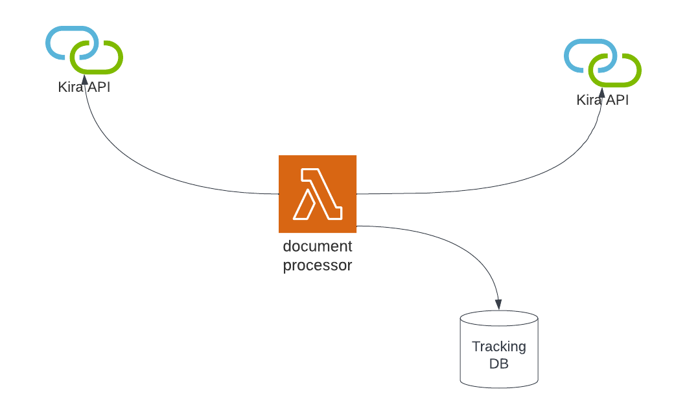

# Architecture

## Application Architecture

The system accesses the SERFF API to retrieve records that should be sent to KIRA.

Documents are identified in SERFF by their status.

-   ready for kira
-   processing by kira
-   processed by kira

-   the process is run on a regular schedule
    -   every 15 minutes
        -   check serff for documents with status "ready for kira"
        -   register document in tracking database
        -   submit document to kira
        -   if success
            -   change status to "processing by kira" in tracking db
            -   set status in serff to "processing by kira"
            -   if error - notify
        -   if failure try again until
            -   no success after x tries, notify of failure
            -   success
        -   check kira for completion of document
            -   if success
                -   remove from kira
                -   notify of results
                -   can this be done in this order? will the doc stick around after removing the input?

## Technical Architecture

